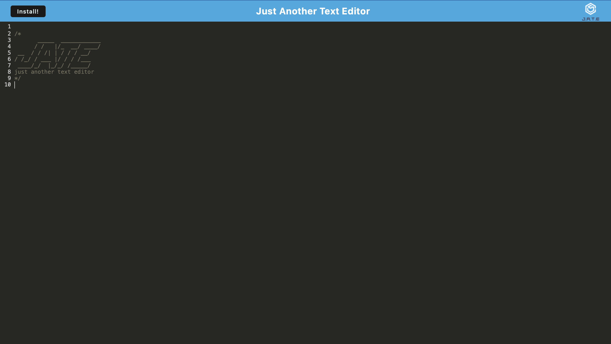

# J.A.T.E-PWA

# Description
J.A.T.E-PWA provides a simple, downloadable text editor with Javascript styling for code related note taking.

### Key Features
* Snippets of code look similar to how they would in VScode.
* Uses IndexedDB to save your notes.
* Application is a PWA so you can download it.
* Application uses asset caching so you can use it offline.

# Technologies
* node.js
* express
* concurrently
* webpack
* webpack-pwa-manifest
* workbox-webpack-plugin

Application deployed live here: https://glb-text-editor-pwa.herokuapp.com/

Screenshot:  

